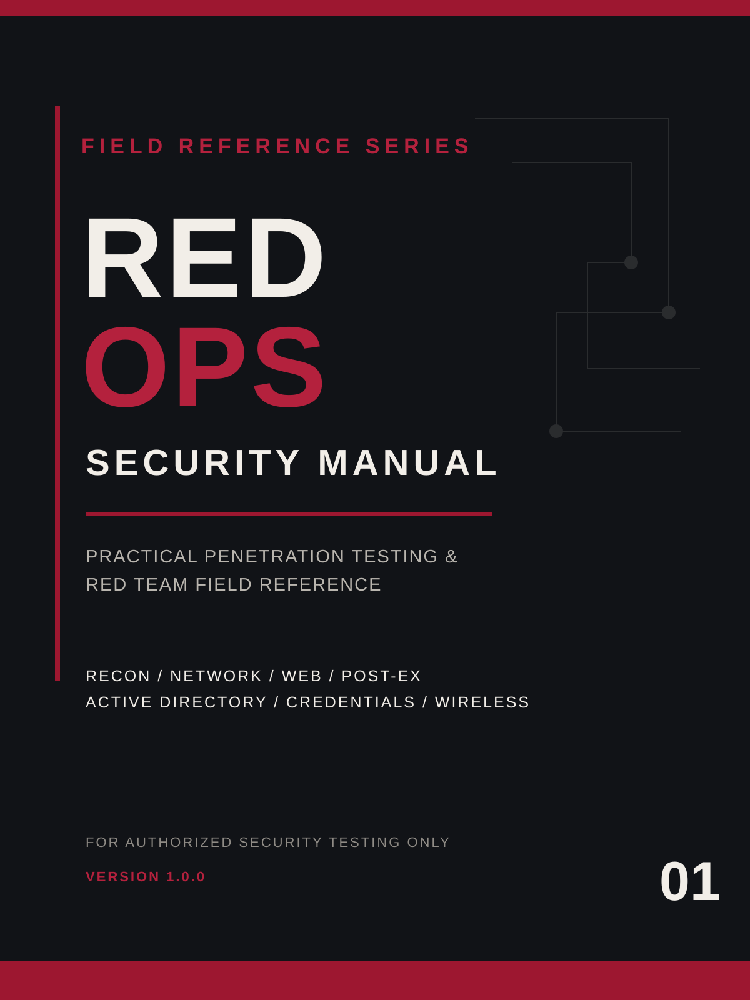

# RED OPS Security Manual

**Practical penetration testing & red team field reference for authorized security testing.**

RED OPS is a connected field manual built around the workflow of a real security assessment: scope, recon, enumeration, web discovery, post-exploitation, Active Directory, credential testing, wireless auditing, hand-offs, and reporting.

> **Authorized use only.** This project is intended for scoped penetration tests, controlled labs, CTFs, owned infrastructure, and security training. It does not grant authorization to test third-party systems.

## Public preview

This repository intentionally contains a **limited public preview**, not the full manual.

The preview shows the assessment workflow, Complete Edition structure, field-reference design system, and project scope without publishing a complete operational chapter or the full field-card set.

**[Open the public preview](PREVIEW.md)**

## Complete Edition

The separately distributed **RED OPS Security Manual v1.0.0 — Complete Edition** contains:

- **107-page** connected field manual
- **7 complete standalone guides**
- **28-page RED OPS Field Cards**
- OSINT & external recon
- Nmap / network recon
- web content discovery
- post-exploitation & privilege escalation
- Active Directory tooling
- credential testing & cracking
- wireless auditing
- cross-guide workflow hand-offs and field playbooks

The Complete Edition is a commercial product and is **not stored in this public repository**.

## Why this repository is intentionally small

The public repository is the official home for the project, release information, preview material, and future announcements. The full editorial source tree, build system, technical reviews, complete chapters, field-card set, and customer package remain private.

## Version

Current public release: **v1.0.0**  
Release date: **2026-09-09**

## License

The RED OPS documentation, artwork, preview material, and editorial content in this repository are **All Rights Reserved** unless a file explicitly states otherwise. See [LICENSE.md](LICENSE.md).

## Security and accuracy

Security tools and command-line interfaces change over time. Version-sensitive syntax should always be checked against the installed version and current upstream documentation before use in a live engagement.

---

**RED OPS Security Manual**  
Field Reference Series / Security Manual  
For authorized security testing only.
